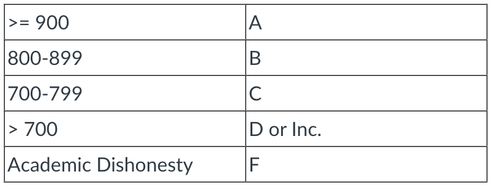
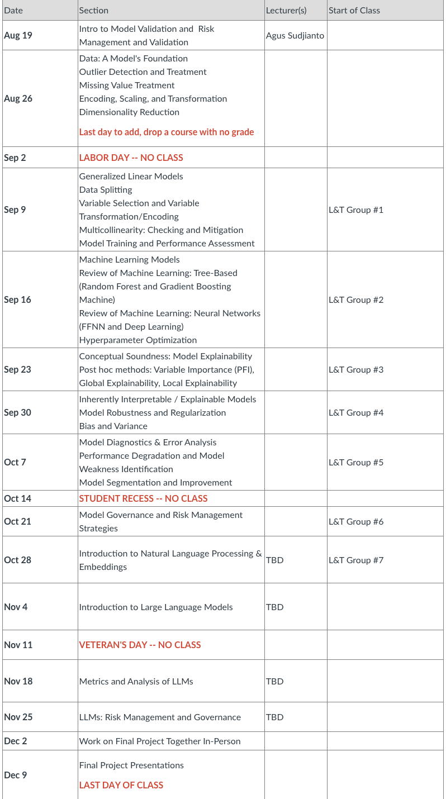

# DSBA6010 - Model Risk Management
- #### The purpose of this syllabus is to set out policies and expectations for the course.  Syllabus policies and expectations are intended to create a productive learning atmosphere for all students.  The syllabus may change over the course of the semester; and all such changes will be noted in class and announced via Canvas announcements (which should go to your UNC Charlotte email).

Course Prerequisites:

STAT 3122 and STAT 3123, or by permission of department.  DSBA 6156 (Applied Machine Learning).

Textbook:

There is no required textbook for this course.

Software:

You may use any software to begin the semester. However you are expected to be able to code everything in Python by the end of the semester. The group project must be coded in Python.

Course Description:

This course provides students a survey of major risk elements in quantitative predictive modeling. Basic steps and considerations in developing models are discussed, including topics such as performance measures, variable screening, transformation, and selection. The focus of the course is however placed on finding ways to improve models to better control risks. Topics discussed include causality, over-fitting/under-fitting, local and global interpretability and explainability, permutation, global sensitivity, global importance, partial dependence, LIME and SHAP, integrated gradient method, robustness, boundary perturbation, reliability, variability, conformability, resilience, natural language processing, fairness, etc.

Course Objectives:

As a counterpart of model development, model validation takes on an increasingly important role in controlling quantitative model risks, in a broadened risk environment. Model risk management is a complex field of study consisting of concepts and techniques across a wide spectrum. The primary objective of this course is to give students an introductory exposure to the foundation of model risk control via model validation.

Grades:

There are 1,000 points in this course, divided:

150 points for Participation
Attendance
In-class activities
Online activities / discussion
Points may be awarded for thoughtful questions or meaningful contributions when in class.
400 points for Individual Assignments
150 points for Learn & Teach Group Projects
300 points for Final Group Project
Based on your points at the end of the class, your final grade will be:

Course Schedule:
